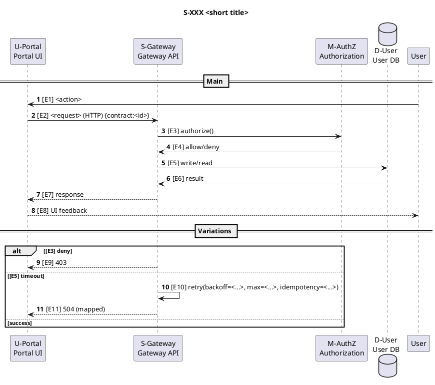

# Plan作成ルール（C4語彙固定 + Scenario Ledger）
> 目的：Planで「中間粒度（コンポーネント／プロセス境界）」の設計網羅性を、LLMでも“書きやすく・レビューしやすく”する。

---

## 1. 適用範囲（この文書が扱う粒度）
- 対象：機能より細かく、クラスより粗い層（例：Container/Component、MVC単位、プロセス間通信の単位）
- Planで扱う：設計レベルの「構成（箱）」「協調（シナリオ）」「実装の住所（配置）」まで
- Planで扱わない：作業手順・WBS・細かな実装TODO（それらはTasksで扱う）

---

## 2. 基本原則（必ず守る）
### 原則A：語彙（箱）を先に固定する
- 変更を行う前に、対象範囲の C4（Container/Component）を特定し、名称を固定する。
- 既存に無い場合は、必要最小の C4 を新規作成する（最初は粗くて良い）。

### 原則B：シナリオで協調を網羅する
- 仕様の文章を、Scenario Ledger（台帳）に落とし込む。
- 「重要ユースケース」「外部IF」「運用・管理」「エラー・例外」をシナリオとして扱う（成功パスだけ禁止）。
- 各シナリオに対して、PlantUMLのシーケンス図とComponent–Step Mapを作成することで、網羅性を担保してレビュー可能性も上げる

### 原則C：実装の住所（コード対応）を1行で持つ
- 各Container/Componentに、実装上の“住所”（プロジェクト/ディレクトリ/サービス名など）を最低1つ紐付ける。
- 「実装する場所が正しいか」をレビュー可能にする。

### 原則D：意思決定の理由はADRに隔離する
- Planは事実（構成・協調・制約）に集中し、議論・採否の理由はADRへ分離する。

---

## 3. Planの必須セクション構成（LLMはこの順で出力する）
1. **粒度宣言（Granularity）**
2. **C4語彙テーブル（Vocabulary）**
3. **Scenario Ledger（必須）**
4. **コード対応（Mapping）**
5. **網羅性チェック（Checklist）**
6. **TBD / Open Questions（任意・最小）**
7. **関連ADR一覧（ある場合）**

---

## 4. テンプレート（そのまま使う）

### 4.1 粒度宣言（Granularity）
- このPlanで扱うC4レベル：`Container` / `Component`（どちらまで降りるか明記）
- このPlanで**扱わない**粒度：`Class` / `Method` など
- 目的：レビューで「粒度がブレてないか」を判断できること

例：
- 対象粒度：Container + 選択したComponent（UI境界、API境界、プロセス間IFに関わる部分のみ）
- 非対象：クラス図・メソッド単位の設計

---

### 4.2 C4語彙テーブル（Vocabulary）
**ルール**
- すべての箱に一意IDを付ける（例：`C-WebUI`, `C-Api`, `Cmp-Auth`, `Cmp-OrderOrchestrator`）
- 以後のPlan本文では **ID + 名前** を基本表記にする（名前の揺れを抑える）
- 別名（旧名/俗称）がある場合はAliasに入れる

**表：Vocabulary**
| ID | 種別 | 正式名 | 役割（1行） | 住所（実装の場所） | 主要IF/依存 | Alias（任意） |
|---|---|---|---|---|---|---|
| S-Gateway | Service | Gateway API | 外部要求の入口 | src/services/gateway | HTTP | api |
| U-Portal | UI | Portal UI | 操作と表示 | src/apps/portal | S-Gateway | web |
| M-AuthZ | Module | Authorization | 権限判定 | src/services/gateway/authz | D-User, X-IdP | auth |
| D-User | Data | User DB | ユーザー情報 | infra/db/user | SQL | - |
| X-IdP | External | Identity Provider | 外部認証基盤 | (external) | OAuth/OIDC | - |

**注**
- 「住所」は、最低1つでよい（複数あってもよい）
- 主要IF/依存は“名詞で”短く書く（例：`HTTP`, `gRPC`, `Queue`, `File`, `DB`）

---

### 4.3 Scenario Ledger（台帳）
**ルール**
- すべてのシナリオに一意IDを付ける（例：`S-010`）
- 各シナリオは必ず **参加者（VocabularyのID）** を列挙する
- この表の各行（Scenario ID）について、直下の「Scenario Details」に **同じScenario IDの詳細ブロック**を必ず1つ作成する。
- 「Scenario Details」が存在しないScenarioが1つでもあるPlanは未完了。

**表：Scenario Ledger**
| Scenario ID | 目的/価値（1行） | Given（前提） | When（トリガ） | Then（結果） | 参加者（Vocabulary ID） | 入出力/メッセージ | 例外・タイムアウト・リトライ | 観測点（ログ/メトリクス） | 参照（仕様章/要件ID等） |
|---|---|---|---|---|---|---|---|---|---|
| S-120 | ユーザーがプロフィール更新できる | ログイン済み | 保存ボタン押下 | 変更が永続化 | U-Portal, S-Gateway, M-AuthZ, D-User | HTTP: PUT /profile | 409競合→再取得促し | log:profile_saved / metric:profile_save_ok | Spec §3 |

**書き方（短いルール）**
- Given/When/Thenは、曖昧語（「適切に」「必要に応じて」）を避け、主語・目的語・動詞を揃える
- 参加者は必ず Vocabulary ID を使う（新語が必要なら先にVocabularyへ追加）
- 例外欄には「何が起きるか」と「どう扱うか」を最低1行で書く  
  例：`Timeout -> 3回まで指数バックオフで再試行。冪等キー必須。`

### Scenario Details

> REQUIRED:
> - 下記ブロックを **Scenario Ledgerの行数ぶん繰り返す**（1行につき1ブロック）。
> - 各ブロックは、見出し「##### Sequence（PlantUML）」「##### Component–Step Map」を **省略禁止**。
> - Sequence内の各メッセージは、先頭にStepID `[E1] [E2]...` を付ける（Mapで参照するため）。
> - 分岐/例外は `alt/else/end` を使い、成功パスだけは禁止。PlantUMLの構文に従う。  <!-- see PlantUML docs -->

### Scenario S-XXX <short title>
**Summary:** <1-2 lines>
**Participants (C4 IDs):** <comma-separated>

##### Sequence（PlantUML）

- 各メッセージの先頭にステップIDを付ける（例：`[E1] [E2] ...`）
- 参加者（表示名= C4 IDを含めてOK / alias= PlantUMLで安全な識別子）
- alias規則: C4 ID の "-" は "_" に置換（他の記号も必要なら "_"）
actor "User" as User

:::{uml}

:::

##### Component–Step Map（人間レビュー用：どの部品がどのStepに関与？）

- U-Portal: Steps <E1,E2,E8,...>
- S-Gateway: Steps <E2,E3,E5,E7,...>
- M-AuthZ: Steps <E3,E4,...>
- D-User: Steps <E5,E6,...>

---

### 4.4 コード対応（Mapping）
**目的**：設計上の“箱”が、実装上の“場所”に落ちているかを確認できるようにする。

| Vocabulary ID | 実装の住所（具体） | 主なエントリポイント | テスト観点（最小） |
|---|---|---|---|
| S-Gateway | src/services/gateway | Program.cs / Controllers | 200/4xx/5xx と相関ID |
| M-AuthZ | src/services/gateway/authz | AuthZService | allow/deny と監査ログ |
| D-User | infra/db/user | migration/sql | 競合・ロールバック |

---

### 4.5 網羅性チェック（Checklist）
LLMはPlan末尾に、このチェックを **Yes/No と根拠（参照ID）** で出力する。

**A. 語彙（箱）**
- [ ] (A1) Plan内に登場する箱はすべてVocabularyにある  
- [ ] (A2) Vocabularyの各箱に“役割1行”と“住所”がある  

**B. シナリオ**
- [ ] (B1) 仕様章/要件IDごとに、対応するScenario IDがある（逆引きできる）  
- [ ] (B2) 外部IFが絡む箇所に、例外/タイムアウト/リトライ方針がある（または対象外が明記）  
- [ ] (B3) 運用・管理（起動/停止/再処理/権限/設定変更）シナリオがある（必要なら）  

**C. 実装の妥当性**
- [ ] (C1) シナリオ参加者の“住所”が全て埋まっている  
- [ ] (C2) 「どこに実装するか」がScenario→Vocabulary→住所で追える  

---

## 5. ADR（意思決定記録）の最小テンプレ
- Title：何を決めたか（短く）
- Context：なぜ問題か/背景
- Decision：決定内容（1〜3行）
- Consequences：得るもの/失うもの（トレードオフ）
- Status：Proposed / Accepted / Superseded

---

## 6. 参考（このルールの土台）
以下は「用語の定義」「テンプレの狙い」を確認するための参照先。参照リンクの文章をそのまま転載しないこと。必要なら自分の言葉で要約して書くこと。

```text
C4 model（公式）: https://c4model.com/
arc42 Section 5 (Building Block View): https://docs.arc42.org/section-5/
arc42 Section 6 (Runtime View): https://docs.arc42.org/section-6/
Gherkin Reference（公式/Cucumber）: https://cucumber.io/docs/gherkin/reference/
ADR（総合ポータル）: https://adr.github.io/
```


