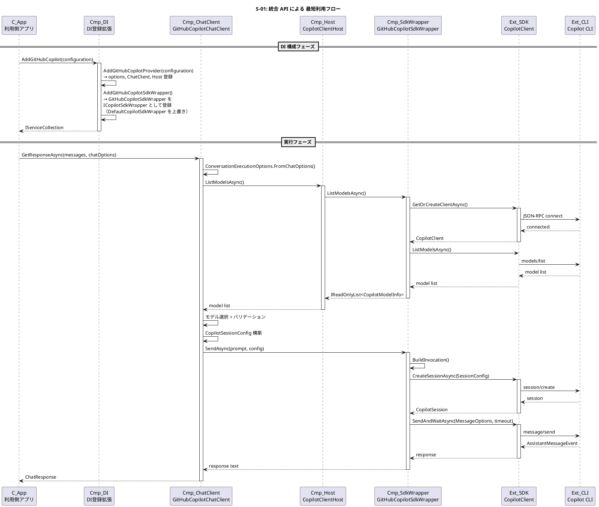
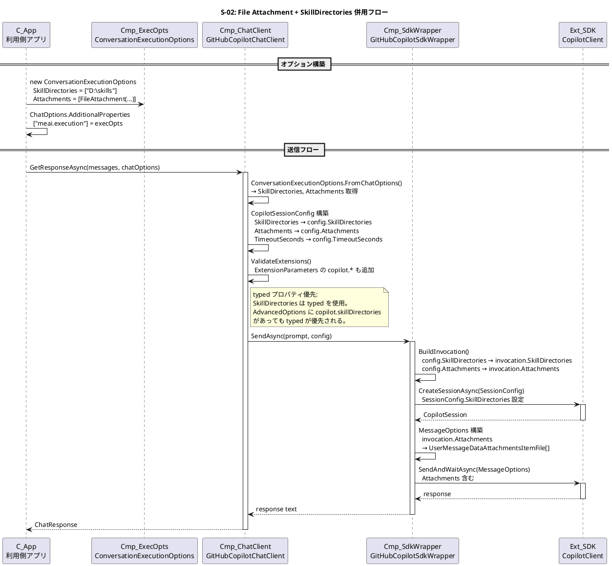
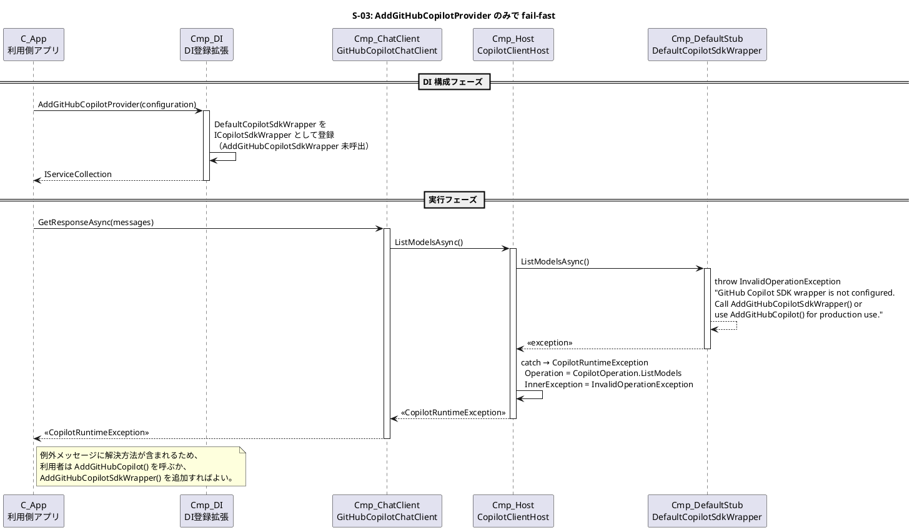
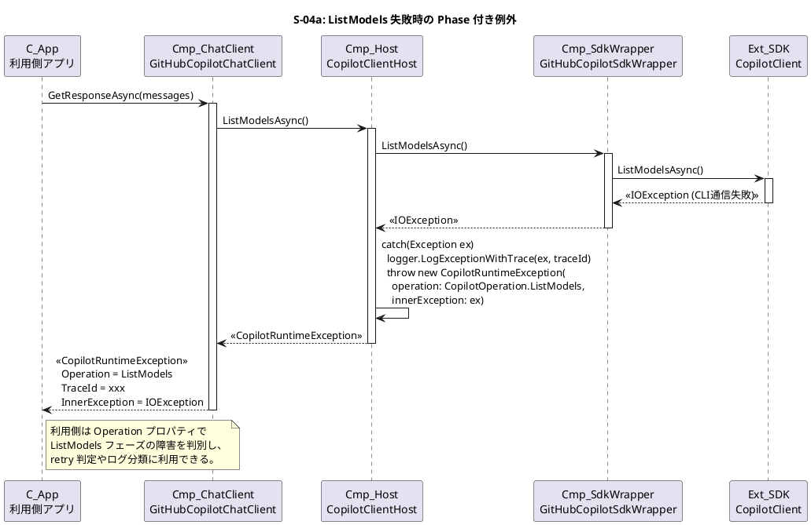
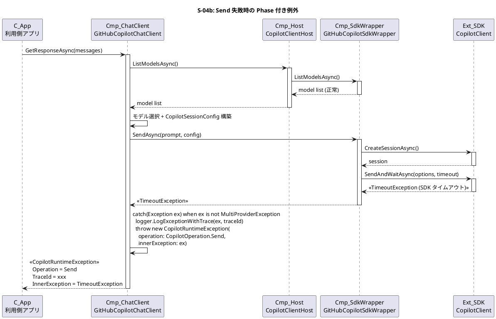
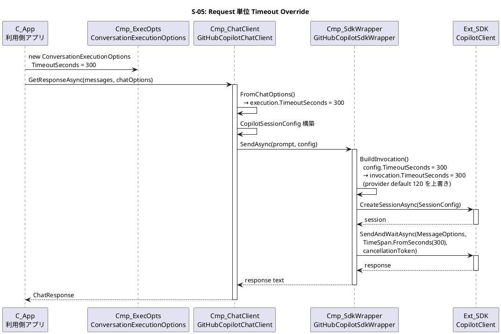
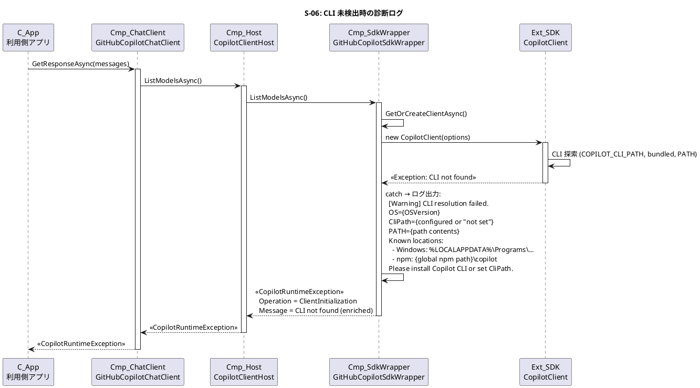
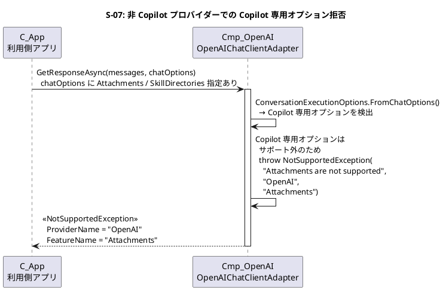

# GitHub Copilot プロバイダー改善・拡張 — Runtime Evidence

**対象 Plan**: `plans/copilot-provider-improvements-and-extensions.md`  
**Date**: 2026-04-06

---

## 粒度宣言（Granularity）

- 対象粒度: Container + Component（DI 登録境界、Adapter/Wrapper 間 IF、SDK 呼び出し境界）
- 非対象: クラスフィールド・メソッド内部ロジック

---

## C4 語彙テーブル（Vocabulary）

| ID | レベル | 名前 | 説明 | 実装住所 |
|----|--------|------|------|---------|
| C-App | Container | 利用側アプリケーション | meai_utility_impl を利用するアプリ | (外部) |
| C-Core | Container | MeAiUtility.MultiProvider | 公開 API・抽象化コア | `src/MeAiUtility.MultiProvider/` |
| C-Copilot | Container | MeAiUtility.MultiProvider.GitHubCopilot | Copilot プロバイダー | `src/MeAiUtility.MultiProvider.GitHubCopilot/` |
| Cmp-DI | Component | DI 登録拡張 | `GitHubCopilotServiceExtensions` | `Configuration/GitHubCopilotServiceExtensions.cs` |
| Cmp-ChatClient | Component | GitHubCopilotChatClient | IChatClient 実装 | `GitHubCopilotChatClient.cs` |
| Cmp-Host | Component | CopilotClientHost | SDK client ライフサイクル管理 | `CopilotClientHost.cs` |
| Cmp-SdkWrapper | Component | GitHubCopilotSdkWrapper | SDK 呼び出し・セッション管理 | `GitHubCopilotSdkWrapper.cs` |
| Cmp-DefaultStub | Component | DefaultCopilotSdkWrapper | fail-fast スタブ | `Configuration/GitHubCopilotServiceExtensions.cs` (内部クラス) |
| Cmp-ExecOpts | Component | ConversationExecutionOptions | request 単位オプション | `Options/ConversationExecutionOptions.cs` |
| Cmp-FileAttachment | Component | FileAttachment | ファイル添付型 (新規) | `Options/FileAttachment.cs` |
| Ext-SDK | External | GitHub Copilot SDK | CopilotClient / CopilotSession | NuGet: GitHub.Copilot.SDK |
| Ext-CLI | External | Copilot CLI | CLI server (JSON-RPC) | copilot バイナリ |

---

## Scenario Sections

### Scenario S-01: 統合 API による GitHub Copilot 最短利用

#### Sequence (PlantUML)

#### Component–Step Map

| Step | From | To | 操作 | 備考 |
|------|------|----|------|------|
| 1 | C-App | Cmp-DI | AddGitHubCopilot | 統合 API: provider + SDK wrapper 一括登録 |
| 2 | Cmp-DI | Cmp-DI | AddGitHubCopilotProvider | options, ChatClient, Host 登録 |
| 3 | Cmp-DI | Cmp-DI | AddGitHubCopilotSdkWrapper | GitHubCopilotSdkWrapper → ICopilotSdkWrapper |
| 4 | C-App | Cmp-ChatClient | GetResponseAsync | 実行開始 |
| 5 | Cmp-ChatClient | Cmp-Host | ListModelsAsync | モデル一覧取得 |
| 6 | Cmp-Host | Cmp-SdkWrapper | ListModelsAsync | SDK 経由 |
| 7 | Cmp-SdkWrapper | Ext-SDK | GetOrCreateClientAsync | 初回のみ CopilotClient 生成 |
| 8 | Cmp-SdkWrapper | Ext-SDK | ListModelsAsync | CLI 経由モデル取得 |
| 9 | Cmp-ChatClient | Cmp-SdkWrapper | SendAsync | プロンプト送信 |
| 10 | Cmp-SdkWrapper | Ext-SDK | CreateSessionAsync | SessionConfig 付きセッション生成 |
| 11 | Cmp-SdkWrapper | Ext-SDK | SendAndWaitAsync | MessageOptions 付きメッセージ送信 |

---

### Scenario S-02: File Attachment + SkillDirectories 併用

#### Sequence (PlantUML)

#### Component–Step Map

| Step | From | To | 操作 | 備考 |
|------|------|----|------|------|
| 1 | C-App | Cmp-ExecOpts | オプション構築 | SkillDirectories + Attachments 設定 |
| 2 | C-App | Cmp-ChatClient | GetResponseAsync | chatOptions 経由で ExecOpts 伝達 |
| 3 | Cmp-ChatClient | Cmp-ChatClient | FromChatOptions | typed プロパティ抽出 |
| 4 | Cmp-ChatClient | Cmp-ChatClient | CopilotSessionConfig 構築 | SkillDirectories / Attachments / TimeoutSeconds を typed プロパティへ設定 |
| 5 | Cmp-ChatClient | Cmp-SdkWrapper | SendAsync | config に SkillDirectories + Attachments |
| 6 | Cmp-SdkWrapper | Cmp-SdkWrapper | BuildInvocation | typed プロパティを invocation へマッピング |
| 7 | Cmp-SdkWrapper | Ext-SDK | CreateSessionAsync | SessionConfig.SkillDirectories 設定 |
| 8 | Cmp-SdkWrapper | Cmp-SdkWrapper | MessageOptions 構築 | FileAttachment → UserMessageDataAttachmentsItemFile 変換 |
| 9 | Cmp-SdkWrapper | Ext-SDK | SendAndWaitAsync | Attachments 付き MessageOptions |

---

### Scenario S-03: AddGitHubCopilotProvider のみ (fail-fast)

#### Sequence (PlantUML)

#### Component–Step Map

| Step | From | To | 操作 | 備考 |
|------|------|----|------|------|
| 1 | C-App | Cmp-DI | AddGitHubCopilotProvider | SDK wrapper 未登録（DefaultStub のまま） |
| 2 | C-App | Cmp-ChatClient | GetResponseAsync | 実行開始 |
| 3 | Cmp-ChatClient | Cmp-Host | ListModelsAsync | |
| 4 | Cmp-Host | Cmp-DefaultStub | ListModelsAsync | fail-fast |
| 5 | Cmp-DefaultStub | Cmp-DefaultStub | throw InvalidOperationException | 解決方法メッセージ付き |
| 6 | Cmp-Host | Cmp-Host | catch → CopilotRuntimeException | Operation = ListModels |
| 7 | Cmp-ChatClient | C-App | 例外伝播 | Phase 情報付き |

---

### Scenario S-04a: ListModels 失敗時の Phase 付き例外

#### Sequence (PlantUML)

#### Component–Step Map

| Step | From | To | 操作 | 備考 |
|------|------|----|------|------|
| 1 | C-App | Cmp-ChatClient | GetResponseAsync | |
| 2 | Cmp-ChatClient | Cmp-Host | ListModelsAsync | |
| 3 | Cmp-Host | Cmp-SdkWrapper | ListModelsAsync | |
| 4 | Cmp-SdkWrapper | Ext-SDK | ListModelsAsync | CLI 通信失敗 |
| 5 | Cmp-Host | Cmp-Host | catch → CopilotRuntimeException | Operation = ListModels |
| 6 | Cmp-ChatClient | C-App | 例外伝播 | Phase 情報 + TraceId 付き |

---

### Scenario S-04b: Send 失敗時の Phase 付き例外

#### Sequence (PlantUML)

#### Component–Step Map

| Step | From | To | 操作 | 備考 |
|------|------|----|------|------|
| 1 | C-App | Cmp-ChatClient | GetResponseAsync | |
| 2 | Cmp-ChatClient | Cmp-Host | ListModelsAsync | 正常成功 |
| 3 | Cmp-ChatClient | Cmp-SdkWrapper | SendAsync | |
| 4 | Cmp-SdkWrapper | Ext-SDK | CreateSessionAsync | 正常 |
| 5 | Cmp-SdkWrapper | Ext-SDK | SendAndWaitAsync | タイムアウト発生 |
| 6 | Cmp-ChatClient | Cmp-ChatClient | catch → CopilotRuntimeException | Operation = Send |
| 7 | Cmp-ChatClient | C-App | 例外伝播 | Phase 情報 + TraceId 付き |

---

### Scenario S-05: Request 単位 Timeout Override

#### Sequence (PlantUML)

#### Component–Step Map

| Step | From | To | 操作 | 備考 |
|------|------|----|------|------|
| 1 | C-App | Cmp-ExecOpts | TimeoutSeconds = 300 設定 | |
| 2 | C-App | Cmp-ChatClient | GetResponseAsync | chatOptions 経由 |
| 3 | Cmp-ChatClient | Cmp-ChatClient | FromChatOptions | TimeoutSeconds 抽出 |
| 4 | Cmp-ChatClient | Cmp-SdkWrapper | SendAsync | config に TimeoutSeconds |
| 5 | Cmp-SdkWrapper | Cmp-SdkWrapper | BuildInvocation | TimeoutSeconds = 300 で上書き |
| 6 | Cmp-SdkWrapper | Ext-SDK | SendAndWaitAsync | TimeSpan.FromSeconds(300) |

---

### Scenario S-06: CLI 未検出時の診断ログ

#### Sequence (PlantUML)

#### Component–Step Map

| Step | From | To | 操作 | 備考 |
|------|------|----|------|------|
| 1 | C-App | Cmp-ChatClient | GetResponseAsync | |
| 2 | Cmp-ChatClient | Cmp-Host | ListModelsAsync | |
| 3 | Cmp-Host | Cmp-SdkWrapper | ListModelsAsync | |
| 4 | Cmp-SdkWrapper | Ext-SDK | new CopilotClient | CLI 探索失敗 |
| 5 | Cmp-SdkWrapper | Cmp-SdkWrapper | 診断ログ出力 | OS, PATH, 候補パスを Warning で出力 |
| 6 | Cmp-SdkWrapper | Cmp-Host | CopilotRuntimeException | Operation = ClientInitialization |

---

### Scenario S-07: 非 Copilot プロバイダーでの Copilot 専用オプション拒否

#### Sequence (PlantUML)

#### Component–Step Map

| Step | From | To | 操作 | 備考 |
|------|------|----|------|------|
| 1 | C-App | Cmp-OpenAI | GetResponseAsync | Attachments / SkillDirectories / DisabledSkills 指定あり |
| 2 | Cmp-OpenAI | Cmp-OpenAI | Copilot 専用オプション検査 | サポート外を検出 |
| 3 | Cmp-OpenAI | C-App | NotSupportedException | FeatureName は検出した対象オプション名 |

---

## Scenario Ledger

| ID | シナリオ名 | 分類 | 関連 WA | 参照 |
|----|-----------|------|---------|------|
| S-01 | 統合 API による GitHub Copilot 最短利用 | 正常系 (main success) | WA-1 | [S-01](#scenario-s-01-統合-api-による-github-copilot-最短利用) |
| S-02 | File Attachment + SkillDirectories 併用 | 正常系 (alternate)| WA-2, WA-3 | [S-02](#scenario-s-02-file-attachment--skilldirectories-併用) |
| S-03 | AddGitHubCopilotProvider のみ (fail-fast) | エラー系 | WA-1, WA-4 | [S-03](#scenario-s-03-addgithubcopilotprovider-のみ-fail-fast) |
| S-04a | ListModels 失敗時の Phase 付き例外 | エラー系 | WA-4 | [S-04a](#scenario-s-04a-listmodels-失敗時の-phase-付き例外) |
| S-04b | Send 失敗時の Phase 付き例外 | エラー系 | WA-4 | [S-04b](#scenario-s-04b-send-失敗時の-phase-付き例外) |
| S-05 | Request 単位 Timeout Override | 正常系 (alternate) | WA-5 | [S-05](#scenario-s-05-request-単位-timeout-override) |
| S-06 | CLI 未検出時の診断ログ | エラー系 | WA-6 | [S-06](#scenario-s-06-cli-未検出時の診断ログ) |
| S-07 | 非 Copilot プロバイダーでの Copilot 専用オプション拒否 | エラー系 | WA-2, WA-3 | [S-07](#scenario-s-07-非-copilot-プロバイダーでの-copilot-専用オプション拒否) |
