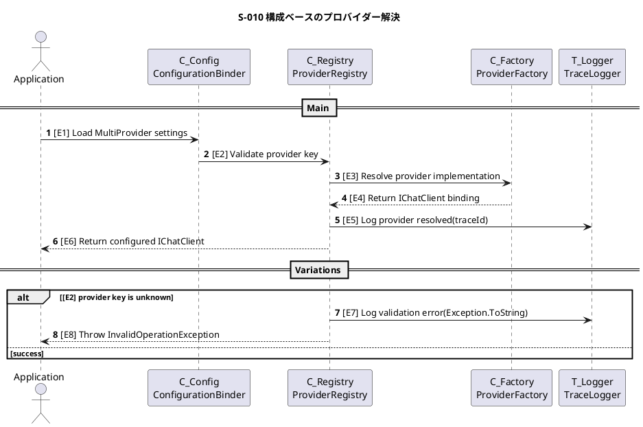
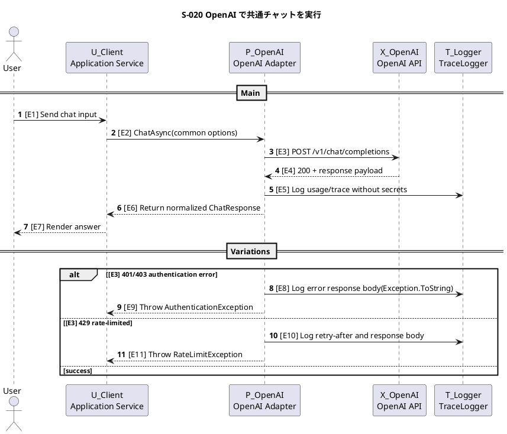
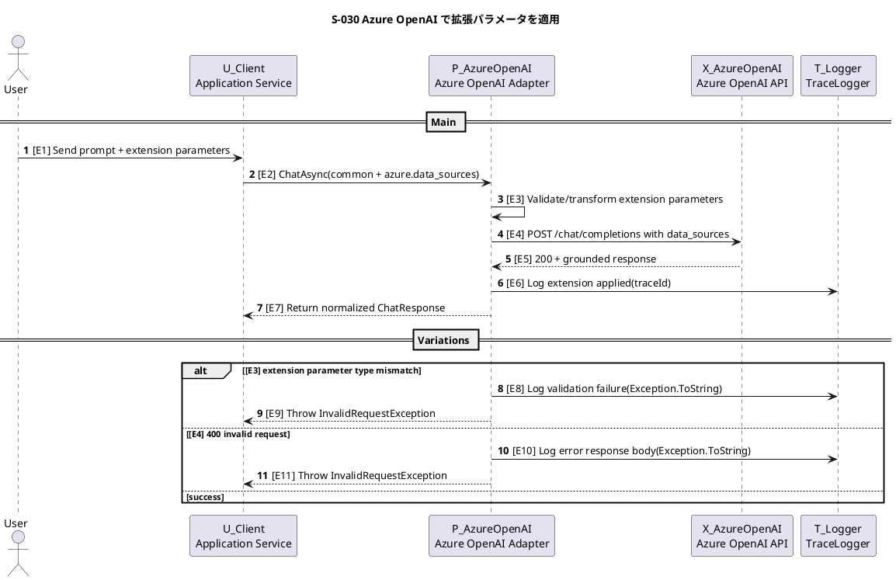
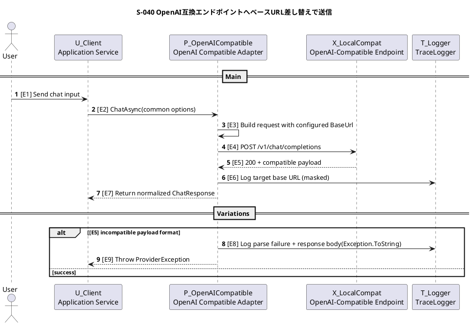
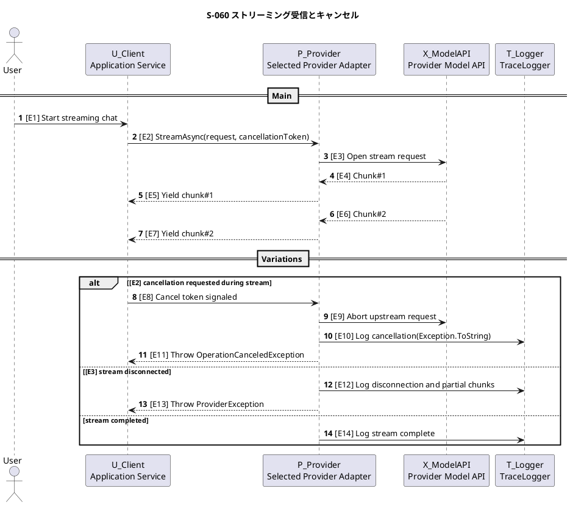
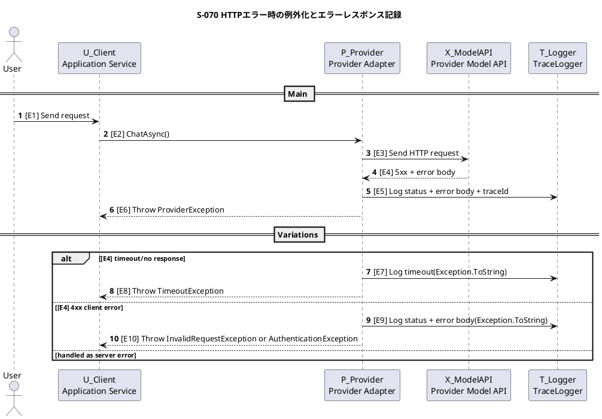

# Runtime Evidence: MEAI マルチプロバイダー抽象化ライブラリ

## Scenario Sections

### Scenario S-010: 構成ベースのプロバイダー解決

#### Sequence (PlantUML)



#### Component–Step Map

| Component | Steps | Evidence |
|---|---|---|
| Application | E1, E6, E8 | DI解決時の成功/失敗 |
| C_Config | E1, E2 | 設定値バインドと基本検証 |
| C_Registry | E2, E3, E5, E7, E8 | プロバイダー選択と例外化 |
| C_Factory | E3, E4 | 実装インスタンス解決 |
| T_Logger | E5, E7 | トレース相関付きログ |

### Scenario S-020: OpenAI で共通チャットを実行

#### Sequence (PlantUML)



#### Component–Step Map

| Component | Steps | Evidence |
|---|---|---|
| User | E1, E7 | 入出力の利用者観点 |
| U_Client | E1, E2, E6, E7, E9, E11 | IChatClient呼び出し面 |
| P_OpenAI | E2, E3, E5, E6, E8, E9, E10, E11 | 共通パラメータ変換と例外化 |
| X_OpenAI | E3, E4 | 外部API応答 |
| T_Logger | E5, E8, E10 | 成功/失敗ログ |

### Scenario S-030: Azure OpenAI で拡張パラメータを適用

#### Sequence (PlantUML)



#### Component–Step Map

| Component | Steps | Evidence |
|---|---|---|
| User | E1 | 拡張要求入力 |
| U_Client | E1, E2, E7, E9, E11 | 共通I/F呼び出しと受領 |
| P_AzureOpenAI | E2, E3, E4, E6, E7, E8, E9, E10, E11 | 拡張解釈とAOAI呼び出し |
| X_AzureOpenAI | E4, E5 | data_sources適用有無 |
| T_Logger | E6, E8, E10 | 検証/エラーログ |

### Scenario S-040: OpenAI互換エンドポイントへベースURL差し替えで送信

#### Sequence (PlantUML)



#### Component–Step Map

| Component | Steps | Evidence |
|---|---|---|
| User | E1 | 利用開始 |
| U_Client | E1, E2, E7, E9 | 共通I/F維持 |
| P_OpenAICompatible | E2, E3, E4, E6, E7, E8, E9 | BaseUrl差し替えと互換吸収 |
| X_LocalCompat | E4, E5 | OpenAI互換応答 |
| T_Logger | E6, E8 | 接続先/エラー記録 |

### Scenario S-050: GitHub Copilot SDK でモデル能力を確認してセッション開始

#### Sequence (PlantUML)

```plantuml
@startuml
title S-050 GitHub Copilot SDK でモデル能力を確認してセッション開始

actor "User" as User
participant "U_Client
Application Service" as U_Client
participant "P_GitHubCopilot
Copilot Adapter" as P_GitHubCopilot
participant "X_CopilotRuntime
Copilot SDK Runtime" as X_CopilotRuntime
participant "T_Logger
TraceLogger" as T_Logger

autonumber

== Main ==
User -> U_Client : [E1] Send chat input + common session options
U_Client -> P_GitHubCopilot : [E2] ChatAsync(model, reasoning effort, tool policy)
P_GitHubCopilot -> X_CopilotRuntime : [E3] List available models
X_CopilotRuntime --> P_GitHubCopilot : [E4] Return model capabilities
P_GitHubCopilot -> P_GitHubCopilot : [E5] Validate reasoning effort support
P_GitHubCopilot -> X_CopilotRuntime : [E6] Create session(Model, ReasoningEffort, AvailableTools, ExcludedTools, Streaming)
X_CopilotRuntime --> P_GitHubCopilot : [E7] Session created
P_GitHubCopilot -> X_CopilotRuntime : [E8] Send prompt
X_CopilotRuntime --> P_GitHubCopilot : [E9] Return assistant message
P_GitHubCopilot -> T_Logger : [E10] Log selected model/reasoning effort(traceId)
P_GitHubCopilot --> U_Client : [E11] Return normalized ChatResponse

== Variations ==
alt [E4] model is unknown or reasoning effort unsupported
  P_GitHubCopilot -> T_Logger : [E12] Log capability mismatch(Exception.ToString)
  P_GitHubCopilot --> U_Client : [E13] Throw NotSupportedException
else [E6] runtime startup or session creation failed
  P_GitHubCopilot -> T_Logger : [E14] Log runtime startup failure(Exception.ToString)
  P_GitHubCopilot --> U_Client : [E15] Throw CopilotRuntimeException
else success
end

@enduml
```

#### Component–Step Map

| Component | Steps | Evidence |
|---|---|---|
| User | E1 | 入力送信 |
| U_Client | E1, E2, E11, E13, E15 | 呼び出しと例外受領 |
| P_GitHubCopilot | E2, E3, E5, E6, E8, E10, E11, E12, E13, E14, E15 | SDKアダプタ層と capability 検証 |
| X_CopilotRuntime | E3, E4, E6, E7, E8, E9 | SDK runtime 応答 |
| T_Logger | E10, E12, E14 | 実行証跡 |

### Scenario S-060: ストリーミング受信とキャンセル

#### Sequence (PlantUML)



#### Component–Step Map

| Component | Steps | Evidence |
|---|---|---|
| User | E1 | ストリーミング開始 |
| U_Client | E1, E2, E5, E7, E8, E11, E13 | チャンク受信とキャンセル伝播 |
| P_Provider | E2, E3, E5, E7, E9, E10, E11, E12, E13, E14 | ストリーム制御 |
| X_ModelAPI | E3, E4, E6, E9 | 上流ストリーム |
| T_Logger | E10, E12, E14 | 中断/切断/完了ログ |

### Scenario S-070: HTTPエラー時の例外化とエラーレスポンス記録

#### Sequence (PlantUML)



#### Component–Step Map

| Component | Steps | Evidence |
|---|---|---|
| User | E1 | リクエスト起点 |
| U_Client | E1, E2, E6, E8, E10 | 例外受領 |
| P_Provider | E2, E3, E5, E6, E7, E8, E9, E10 | HTTPエラー→例外変換 |
| X_ModelAPI | E3, E4 | エラーレスポンス返却 |
| T_Logger | E5, E7, E9 | エラーレスポンス内容記録 |

## Scenario Ledger

| Scenario ID | 目的/価値 | Given | When | Then | 参加者（Vocabulary ID） | 入出力/メッセージ | 例外・タイムアウト・リトライ | 観測点（ログ/メトリクス） | セクション |
|---|---|---|---|---|---|---|---|---|---|
| S-010 | 構成変更のみでプロバイダーを切り替える | MultiProvider設定が存在 | DIで IChatClient を解決 | 対応プロバイダーが解決される | Application, C_Config, C_Registry, C_Factory, T_Logger | 設定読込/解決 | 不正Providerは即例外（フォールバックなし） | provider_resolved, provider_validation_error | [Scenario S-010](#scenario-s-010-構成ベースのプロバイダー解決) |
| S-020 | OpenAIで共通チャットを実行する | Provider=OpenAI | ChatAsync を実行 | 正規化レスポンスを返す | User, U_Client, P_OpenAI, X_OpenAI, T_Logger | Chat request/response | 401/403,429を例外化し記録 | openai_chat_success, openai_chat_error | [Scenario S-020](#scenario-s-020-openai-で共通チャットを実行) |
| S-030 | Azure OpenAI拡張パラメータを適用する | Provider=AzureOpenAI | data_sources付きで実行 | 拡張適用して応答を返す | User, U_Client, P_AzureOpenAI, X_AzureOpenAI, T_Logger | common + azure extensions | 型不一致/400は送信前または応答時に例外化 | azure_extension_applied, azure_extension_validation_error | [Scenario S-030](#scenario-s-030-azure-openai-で拡張パラメータを適用) |
| S-040 | OpenAI互換 endpoint へ送信する | Provider=OpenAICompatible | BaseUrl指定で実行 | 互換応答を正規化して返す | User, U_Client, P_OpenAICompatible, X_LocalCompat, T_Logger | BaseUrl差し替えHTTP | 互換性崩れはパース失敗として例外化 | compatible_target_selected, compatible_parse_error | [Scenario S-040](#scenario-s-040-openai互換エンドポイントへベースurl差し替えで送信) |
| S-050 | GitHub Copilotで model/reasoning effort を使ってチャットする | Provider=GitHubCopilot | ChatAsync を実行 | model capability を確認して session 作成・応答返却 | User, U_Client, P_GitHubCopilot, X_CopilotRuntime, T_Logger | SDK session create + capability query | capability mismatch / 起動失敗を例外化 | copilot_model_selected, copilot_reasoning_effort_validated | [Scenario S-050](#scenario-s-050-github-copilot-sdk-でモデル能力を確認してセッション開始) |
| S-060 | ストリーミングとキャンセルを扱う | ストリーミング有効 | StreamAsync 実行中にキャンセル/切断 | チャンク配信または明確な例外通知 | User, U_Client, P_Provider, X_ModelAPI, T_Logger | async stream chunks | キャンセルはOperationCanceledException、切断はProviderException | stream_chunk_count, stream_canceled, stream_disconnected | [Scenario S-060](#scenario-s-060-ストリーミング受信とキャンセル) |
| S-070 | HTTPエラー詳細を保持し例外化する | 外部APIがエラー返却 | ChatAsync 実行 | ステータスと本文をログ化して例外 | User, U_Client, P_Provider, X_ModelAPI, T_Logger | HTTP error response | 4xx/5xx/timeoutを種別別例外化 | provider_http_error, provider_timeout | [Scenario S-070](#scenario-s-070-httpエラー時の例外化とエラーレスポンス記録) |
